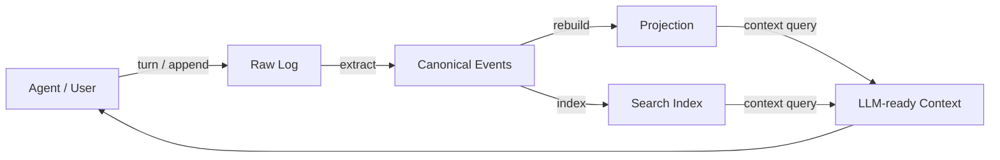
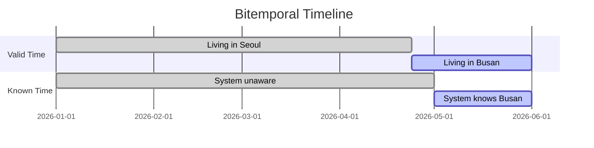
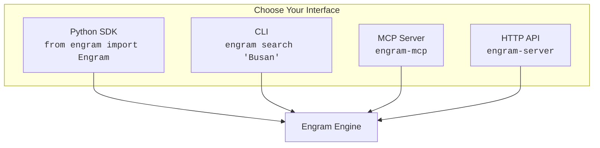
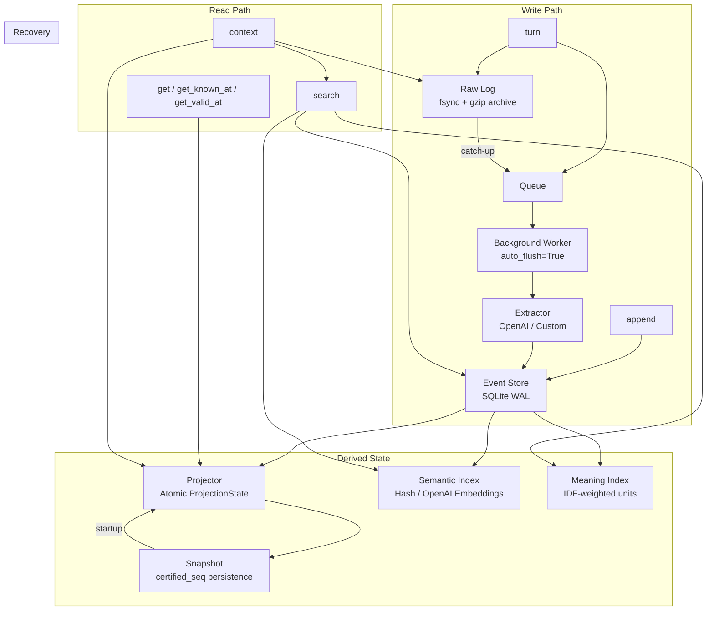

<p align="center">
  
  
  
  
  
</p>

<h1 align="center">Engram</h1>
<p align="center"><strong>The Physical Trace of AI Memory</strong></p>
<p align="center">Structured, auditable long-term memory engine for LLM agents</p>

<p align="center">
  <a href="#quickstart">Quickstart</a> &bull;
  <a href="#why-engram">Why Engram</a> &bull;
  <a href="#sdk">SDK</a> &bull;
  <a href="#cli">CLI</a> &bull;
  <a href="#mcp-server">MCP Server</a> &bull;
  <a href="#http-api">HTTP API</a> &bull;
  <a href="README_ko.md">한국어</a>
</p>

---

## Why Engram

LLMs have no memory. Every conversation starts from zero. Existing solutions fall short:

| Approach | Limitation |
|----------|-----------|
| Stuff full chat history into context | Token limit, cost explosion, lost across sessions |
| Key-value store (mem0, etc.) | No "when did I learn this?" — overwrites erase history |
| Vector search (RAG) | Unstructured text retrieval, no fact tracking |

**Engram is different.** It extracts structured facts from conversations, tracks them across two time dimensions, and lets agents correct past understanding without losing history.



### Two Time Dimensions

```
User says on May 1st: "I moved to Busan last week"

Known-time: System LEARNED this on May 1st
Valid-time: The move actually HAPPENED around April 24th
```



| Query | Answer |
|-------|--------|
| "Where does Alice live?" | Busan |
| "Where did she live on April 20th?" (valid-time) | **Seoul** |
| "What did the system know on April 30th?" (known-time) | **Nothing about the move** |
| "When did the system learn about the move?" | **May 1st** |

---

## Quickstart

```bash
pip install engram
```

```python
from engram import Engram

mem = Engram(user_id="alice")

# Store a conversation
mem.turn(
    user="I moved to Busan last week. Bob is my manager.",
    assistant="Got it, I'll remember that.",
)

# Or record structured observations directly ($0 — no LLM call)
mem.append(
    "entity.create",
    {"id": "user:alice", "type": "user", "attrs": {"location": "Busan"}},
    reason="User stated directly",
)

# Retrieve relevant memory as LLM context
context = mem.context("Alice's location and preferences", max_tokens=2000)
print(context)

# Look up a specific entity
entity = mem.get("user:alice")
print(entity.attrs)  # {'location': 'Busan'}

mem.close()
```

---

## 4 Ways to Use Engram



---

<h2 id="sdk">Python SDK</h2>

```bash
pip install engram
```

### Write

```python
from engram import Engram

mem = Engram(user_id="alice", auto_flush=True)

# From conversation (auto-extracts entities with OpenAI)
mem.turn(user="I'm vegetarian", assistant="Noted!")

# Direct structured write ($0 — no LLM)
mem.append("entity.update", {
    "id": "user:alice",
    "attrs": {"diet": "vegetarian"}
})
```

### Read

```python
# Current state
entity = mem.get("user:alice")

# What the system knew at a specific time
view = mem.get_known_at("user:alice", some_past_time)

# What was actually true at a time
view = mem.get_valid_at("user:alice", last_week)

# Change history
history = mem.known_history("user:alice", attr="location")

# Relations
relations = mem.get_relations("user:alice")

# Search (lexical + semantic + meaning + causal)
results = mem.search("vegetarian diet", k=5)

# LLM-ready context
context = mem.context("Alice's preferences", max_tokens=2000)
```

### With OpenAI Extraction

```bash
pip install engram[openai]
```

```python
from engram import Engram, OpenAIExtractor

mem = Engram(
    user_id="alice",
    extractor=OpenAIExtractor(api_key="sk-..."),
    auto_flush=True,  # Background processing
)

mem.turn(user="I moved to Busan last week", assistant="Got it!")
# Background worker automatically:
#   1. Calls OpenAI to extract entities
#   2. Rebuilds projection
#   3. Updates search index
#   4. Saves snapshot
```

---

<h2 id="cli">CLI</h2>

```bash
pip install engram
```

```bash
# Store
engram turn --user "I'm vegetarian" --assistant "Noted"
engram append entity.create '{"id":"user:alice","type":"user","attrs":{"diet":"vegetarian"}}'

# Query
engram get user:alice
engram search "diet"
engram context "Alice preferences"
engram history user:alice

# Maintenance
engram flush all
```

All commands output JSON. Configure via environment variables:

```bash
export ENGRAM_USER_ID=alice
export ENGRAM_PATH=/data/memory
export ENGRAM_EXTRACTOR=openai  # null | openai
export OPENAI_API_KEY=sk-...
```

---

<h2 id="mcp-server">MCP Server</h2>

For Claude Desktop, Claude Code, and other MCP-compatible agents.

```bash
pip install engram[mcp]
```

### Claude Desktop Configuration

Add to `claude_desktop_config.json`:

```json
{
  "mcpServers": {
    "engram": {
      "command": "engram-mcp",
      "env": {
        "ENGRAM_USER_ID": "alice",
        "ENGRAM_PATH": "/path/to/memory"
      }
    }
  }
}
```

### Available Tools

| Tool | Purpose |
|------|---------|
| `engram_turn` | Store a conversation turn |
| `engram_append` | Record a structured observation |
| `engram_recall` | **Get LLM-ready memory context** |
| `engram_get` | Look up an entity |
| `engram_search` | Search memory |
| `engram_get_relations` | Get entity relations |
| `engram_history` | Get change history |
| `engram_flush` | Flush pipeline |

### Example Agent Usage

```
Agent: [uses engram_recall with query "user dietary preferences"]
Engram: "## Memory Basis\n- user:alice (user) attrs={'diet': 'vegetarian', 'location': 'Busan'}\n..."
Agent: [incorporates memory into response]
```

---

<h2 id="http-api">HTTP API</h2>

```bash
pip install engram[server]
engram-server
# Server running at http://127.0.0.1:8000
```

### Endpoints

| Method | Path | Description |
|--------|------|-------------|
| `POST` | `/turn` | Store conversation turn |
| `POST` | `/append` | Record event |
| `GET` | `/entity/{id}` | Get entity state |
| `GET` | `/entity/{id}/known-at?at=` | Known-time query |
| `GET` | `/entity/{id}/valid-at?at=` | Valid-time query |
| `GET` | `/entity/{id}/history` | Change history |
| `GET` | `/entity/{id}/relations` | Relations |
| `GET` | `/search?query=` | Search |
| `GET` | `/context?query=` | LLM context |
| `POST` | `/flush` | Flush pipeline |
| `POST` | `/reprocess` | Re-extract with new extractor |
| `POST` | `/rebuild-projection` | Rebuild projection |
| `GET` | `/health` | Health check |

```bash
# Example
curl -X POST http://localhost:8000/turn \
  -H "Content-Type: application/json" \
  -d '{"user": "I am vegetarian", "assistant": "Noted!"}'

curl "http://localhost:8000/context?query=diet"
```

---

## Architecture



### Key Properties

| Property | How |
|----------|-----|
| **Crash recovery** | Snapshot restore + canonical rebuild in 18ms (5K events) |
| **Thread safety** | Per-thread reader connections + writer `_tx_lock` |
| **Atomic projection** | `ProjectionState` frozen dataclass, single-assignment swap |
| **Auto retry** | Exponential backoff (1s, 2s, 4s), max 3 attempts |
| **Zero dependencies** | Core engine is pure Python + sqlite3 |

---

## Performance

| Operation | Result | Notes |
|-----------|--------|-------|
| `append()` | **2,500 events/sec** | Direct structured write |
| `turn()` | **2,000 turns/sec** | Queue enqueue only |
| `get()` | **0.1ms** | Entity lookup |
| `search()` | **4-38ms** | Depends on dataset size |
| `context()` | **36ms** | Full context generation |
| Startup recovery | **18ms** | 5K events with snapshot |
| Storage | **~4KB/event** | Including indexes |

---

## Model Configuration

Engram works with **any LLM** via environment variables. All components default to local zero-cost implementations and can be swapped to any OpenAI-compatible provider.

### Quick Setup Examples

```bash
# OpenAI (default)
export ENGRAM_EXTRACTOR=openai
export OPENAI_API_KEY=sk-...
engram-server

# Claude via OpenRouter
export ENGRAM_EXTRACTOR=openai
export ENGRAM_OPENAI_BASE_URL=https://openrouter.ai/api/v1
export ENGRAM_OPENAI_MODEL=anthropic/claude-sonnet-4.6
export OPENAI_API_KEY=sk-or-...
engram-server

# Gemini via Google AI
export ENGRAM_EXTRACTOR=openai
export ENGRAM_OPENAI_BASE_URL=https://generativelanguage.googleapis.com/v1beta/openai
export ENGRAM_OPENAI_MODEL=gemini-2.5-flash
export OPENAI_API_KEY=AIza...
engram-server

# Local model (Ollama)
export ENGRAM_EXTRACTOR=openai
export ENGRAM_OPENAI_BASE_URL=http://localhost:11434/v1
export ENGRAM_OPENAI_MODEL=llama3
export OPENAI_API_KEY=unused
engram-server
```

### All Environment Variables

| Variable | Default | Description |
|----------|---------|-------------|
| `ENGRAM_EXTRACTOR` | `null` | `null` (no extraction) or `openai` |
| `ENGRAM_EMBEDDER` | `hash` | `hash` (local, $0) or `openai` |
| `ENGRAM_MEANING_ANALYZER` | `null` | `null` (no meaning analysis) or `openai` |
| `OPENAI_API_KEY` | — | API key for the provider |
| `ENGRAM_OPENAI_BASE_URL` | — | Custom endpoint (proxy, Azure, local) |
| `ENGRAM_OPENAI_MODEL` | `gpt-5.4-mini` | Chat model for extractor |
| `ENGRAM_OPENAI_EMBED_MODEL` | `text-embedding-3-small` | Embedding model |
| `ENGRAM_OPENAI_EMBED_DIMS` | — | Embedding dimensions override |
| `ENGRAM_OPENAI_MEANING_MODEL` | `gpt-5.4-mini` | Chat model for meaning analyzer |

### Compatible Models

Any model accessible via an OpenAI-compatible API works. Tested providers:

| Provider | Models | Base URL |
|----------|--------|----------|
| **OpenAI** | gpt-5.4-mini, gpt-5.4, gpt-4o-mini | *(default)* |
| **Anthropic** (via proxy) | claude-sonnet-4.6, claude-haiku-4.5 | OpenRouter / LiteLLM |
| **Google** (via proxy) | gemini-2.5-flash, gemini-2.5-pro | Google AI / OpenRouter |
| **Local** | llama3, mistral, phi-3 | Ollama / vLLM |

### Pluggable Components

| Component | Default ($0) | OpenAI Option |
|-----------|-------------|---------------|
| **Extractor** | `NullExtractor` | `OpenAIExtractor` — auto-extracts entities from conversation |
| **Embedder** | `HashEmbedder` | `OpenAIEmbedder` — semantic vector search |
| **MeaningAnalyzer** | `NullMeaningAnalyzer` | `OpenAIMeaningAnalyzer` — IDF-weighted meaning search |

All components implement Protocols — swap in any LLM provider by implementing the interface.

---

## License

MIT

---

<p align="center">
  <strong>Engram</strong> &mdash; The Physical Trace of AI Memory
</p>
