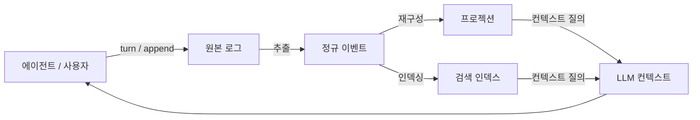
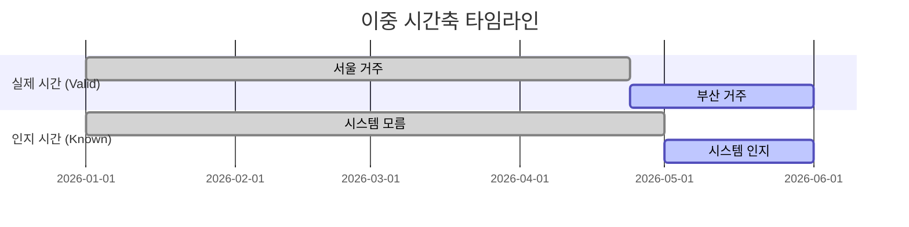
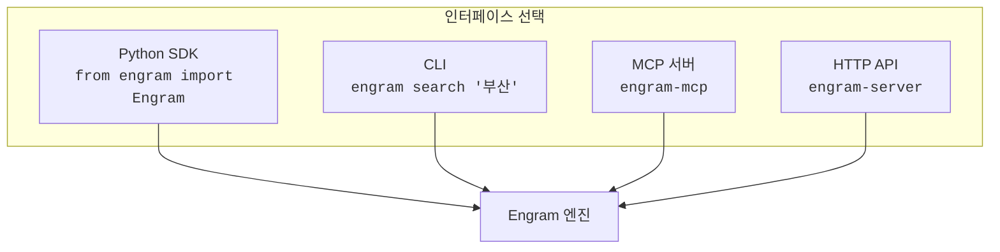
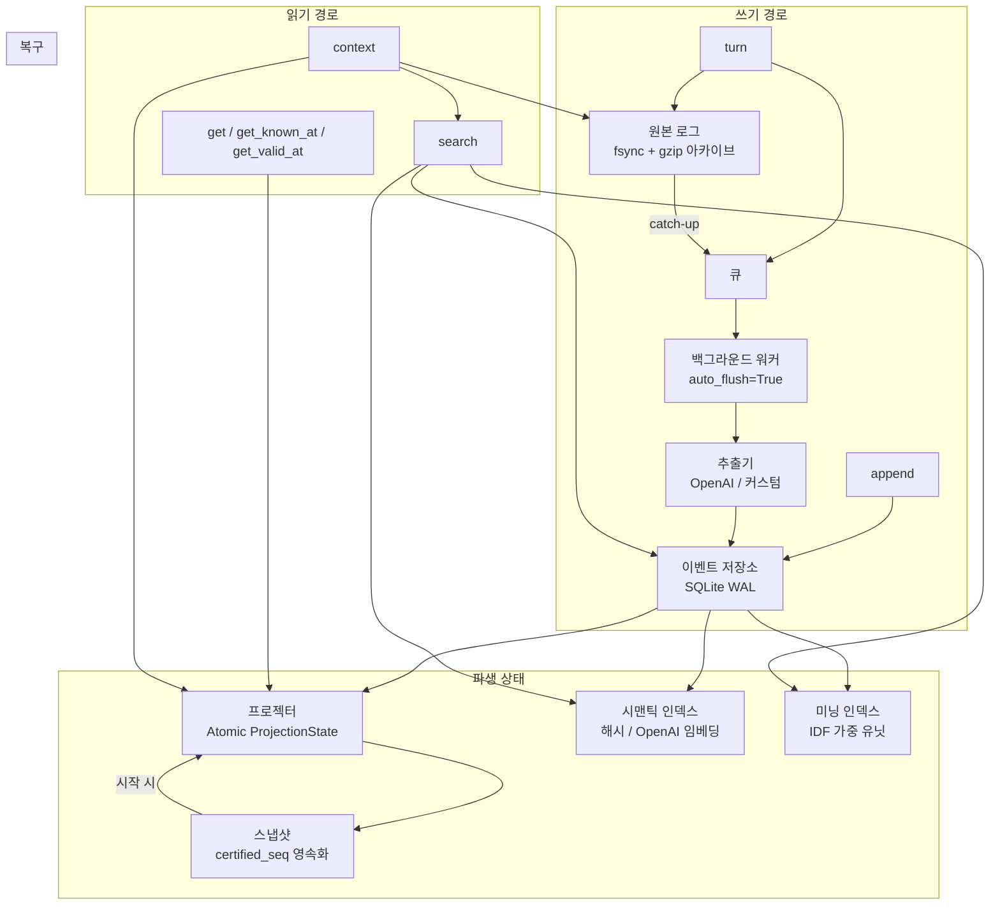

<p align="center">
  
  
  
  
  
</p>

<h1 align="center">Engram</h1>
<p align="center"><strong>AI 기억의 물리적 흔적</strong></p>
<p align="center">LLM 에이전트를 위한 구조화된 장기 기억 엔진</p>

<p align="center">
  <a href="#빠른-시작">빠른 시작</a> &bull;
  <a href="#왜-engram인가">왜 Engram</a> &bull;
  <a href="#sdk">SDK</a> &bull;
  <a href="#cli">CLI</a> &bull;
  <a href="#mcp-서버">MCP 서버</a> &bull;
  <a href="#http-api">HTTP API</a> &bull;
  <a href="README.md">English</a>
</p>

---

## 왜 Engram인가

AI(ChatGPT, Claude)는 **기억이 없습니다.** 매 대화가 빈 종이에서 시작합니다.

| 기존 방법 | 한계 |
|----------|------|
| 대화 전체를 context에 넣기 | 토큰 한계, 비용 폭발, 세션 끊기면 끝 |
| Key-Value 저장 (mem0 등) | "언제 알았는지" 추적 불가, 덮어쓰면 과거 소멸 |
| 벡터 검색 (RAG) | 비정형 텍스트 검색일 뿐, 구조화된 사실 추적 아님 |

**Engram은 다릅니다.** 대화에서 구조화된 사실을 추출하고, 두 개의 시간 축으로 추적하며, 과거를 잃지 않고 수정할 수 있습니다.



### 두 가지 시간

```
5월 1일에 사용자가 말함: "지난주에 부산으로 이사했어"

Known-time: 시스템이 5월 1일에 이 사실을 알게 됨
Valid-time: 실제 이사는 4월 24일경에 일어남
```



| 질문 | 답변 |
|------|------|
| "앨리스 어디 살아?" | 부산 |
| "4월 20일엔 어디 살았어?" (valid-time) | **서울** |
| "4월 30일에 시스템이 뭘 알고 있었어?" (known-time) | **이사 사실을 몰랐음** |
| "시스템이 이사를 언제 알게 됐어?" | **5월 1일** |

---

## 빠른 시작

```bash
pip install engram
```

```python
from engram import Engram

mem = Engram(user_id="alice")

# 대화 저장
mem.turn(
    user="지난주에 부산으로 이사했어. Bob이 내 매니저야.",
    assistant="알겠어요, 기억할게요.",
)

# 또는 구조화 데이터 직접 기록 ($0 — LLM 호출 없음)
mem.append(
    "entity.create",
    {"id": "user:alice", "type": "user", "attrs": {"location": "Busan"}},
    reason="사용자가 직접 말함",
)

# 관련 기억을 LLM 컨텍스트로 조회
context = mem.context("앨리스의 위치와 선호", max_tokens=2000)
print(context)

# 특정 엔티티 조회
entity = mem.get("user:alice")
print(entity.attrs)  # {'location': 'Busan'}

mem.close()
```

---

## 4가지 사용 방법



---

<h2 id="sdk">Python SDK</h2>

```bash
pip install engram
```

### 쓰기

```python
from engram import Engram

mem = Engram(user_id="alice", auto_flush=True)

# 대화에서 자동 추출 (OpenAI 사용 시)
mem.turn(user="나는 채식주의자야", assistant="알겠어요!")

# 구조화 데이터 직접 기록 ($0)
mem.append("entity.update", {
    "id": "user:alice",
    "attrs": {"diet": "vegetarian"}
})
```

### 읽기

```python
# 현재 상태
entity = mem.get("user:alice")

# 특정 시점에 시스템이 알고 있던 것
view = mem.get_known_at("user:alice", 과거_시점)

# 특정 시점에 실제로 유효했던 것
view = mem.get_valid_at("user:alice", 지난주)

# 변경 이력
history = mem.known_history("user:alice", attr="location")

# 관계
relations = mem.get_relations("user:alice")

# 검색 (어휘 + 의미 + 인과)
results = mem.search("채식 식단", k=5)

# LLM 프롬프트용 컨텍스트
context = mem.context("앨리스의 선호", max_tokens=2000)
```

### OpenAI 자동 추출

```bash
pip install engram[openai]
```

```python
from engram import Engram, OpenAIExtractor

mem = Engram(
    user_id="alice",
    extractor=OpenAIExtractor(api_key="sk-..."),
    auto_flush=True,  # 백그라운드 자동 처리
)

mem.turn(user="지난주에 부산으로 이사했어", assistant="알겠어요!")
# 백그라운드 워커가 자동으로:
#   1. OpenAI 호출 → 엔티티 추출
#   2. 프로젝션 재구성
#   3. 검색 인덱스 갱신
#   4. 스냅샷 저장
```

---

<h2 id="cli">CLI</h2>

```bash
pip install engram
```

```bash
# 저장
engram turn --user "나는 채식주의자야" --assistant "알겠어요"
engram append entity.create '{"id":"user:alice","type":"user","attrs":{"diet":"vegetarian"}}'

# 조회
engram get user:alice
engram search "식단"
engram context "앨리스 선호"
engram history user:alice

# 유지보수
engram flush all
```

모든 명령은 JSON으로 출력됩니다. 환경변수로 설정:

```bash
export ENGRAM_USER_ID=alice
export ENGRAM_PATH=/data/memory
export ENGRAM_EXTRACTOR=openai  # null | openai
export OPENAI_API_KEY=sk-...
```

---

<h2 id="mcp-서버">MCP 서버</h2>

Claude Desktop, Claude Code 등 MCP 호환 에이전트에서 사용합니다.

```bash
pip install engram[mcp]
```

### Claude Desktop 설정

`claude_desktop_config.json`에 추가:

```json
{
  "mcpServers": {
    "engram": {
      "command": "engram-mcp",
      "env": {
        "ENGRAM_USER_ID": "alice",
        "ENGRAM_PATH": "/path/to/memory"
      }
    }
  }
}
```

### 사용 가능한 도구

| 도구 | 용도 |
|------|------|
| `engram_turn` | 대화 턴 저장 |
| `engram_append` | 구조화 관찰 기록 |
| `engram_recall` | **LLM 프롬프트용 기억 컨텍스트 생성** |
| `engram_get` | 엔티티 조회 |
| `engram_search` | 기억 검색 |
| `engram_get_relations` | 관계 조회 |
| `engram_history` | 변경 이력 조회 |
| `engram_flush` | 파이프라인 플러시 |

---

<h2 id="http-api">HTTP API</h2>

```bash
pip install engram[server]
engram-server
# 서버 실행: http://127.0.0.1:8000
```

### 엔드포인트

| 메서드 | 경로 | 설명 |
|--------|------|------|
| `POST` | `/turn` | 대화 턴 저장 |
| `POST` | `/append` | 이벤트 기록 |
| `GET` | `/entity/{id}` | 엔티티 상태 |
| `GET` | `/entity/{id}/known-at?at=` | known-time 조회 |
| `GET` | `/entity/{id}/valid-at?at=` | valid-time 조회 |
| `GET` | `/entity/{id}/history` | 변경 이력 |
| `GET` | `/entity/{id}/relations` | 관계 |
| `GET` | `/search?query=` | 검색 |
| `GET` | `/context?query=` | LLM 컨텍스트 |
| `POST` | `/flush` | 파이프라인 플러시 |
| `POST` | `/reprocess` | 재추출 |
| `POST` | `/rebuild-projection` | 프로젝션 재구성 |
| `GET` | `/health` | 상태 확인 |

```bash
# 예시
curl -X POST http://localhost:8000/turn \
  -H "Content-Type: application/json" \
  -d '{"user": "나는 채식주의자야", "assistant": "알겠어요!"}'

curl "http://localhost:8000/context?query=식단"
```

---

## 아키텍처



### 핵심 특성

| 특성 | 구현 방식 |
|------|----------|
| **크래시 복구** | 스냅샷 복원 + 정규 재구성 18ms (5K 이벤트) |
| **스레드 안전** | per-thread reader + writer `_tx_lock` |
| **원자적 프로젝션** | `ProjectionState` frozen dataclass, 단일 할당 |
| **자동 재시도** | 지수 백오프 (1s, 2s, 4s), 최대 3회 |
| **무의존성** | 코어 엔진은 순수 Python + sqlite3 |

---

## 성능

| 연산 | 결과 | 비고 |
|------|------|------|
| `append()` | **2,500 events/sec** | 구조화 데이터 직접 쓰기 |
| `turn()` | **2,000 turns/sec** | 큐 인큐만 |
| `get()` | **0.1ms** | 엔티티 조회 |
| `search()` | **4-38ms** | 데이터셋 크기에 따라 |
| `context()` | **36ms** | 전체 컨텍스트 생성 |
| 시작 복구 | **18ms** | 5K 이벤트 + 스냅샷 |
| 저장 공간 | **~4KB/event** | 인덱스 포함 |

---

## 플러그 가능한 컴포넌트

| 컴포넌트 | 기본값 ($0) | OpenAI 옵션 |
|---------|------------|------------|
| **추출기** | `NullExtractor` | `OpenAIExtractor` — 대화에서 엔티티 자동 추출 |
| **임베더** | `HashEmbedder` | `OpenAIEmbedder` — 시맨틱 벡터 검색 |
| **미닝 분석기** | `NullMeaningAnalyzer` | `OpenAIMeaningAnalyzer` — IDF 가중 의미 검색 |

모든 컴포넌트가 Protocol 기반 — Claude, Gemini, 로컬 모델 등 어떤 LLM이든 연결 가능합니다.

---

## 라이선스

MIT

---

<p align="center">
  <strong>Engram</strong> &mdash; AI 기억의 물리적 흔적
</p>
